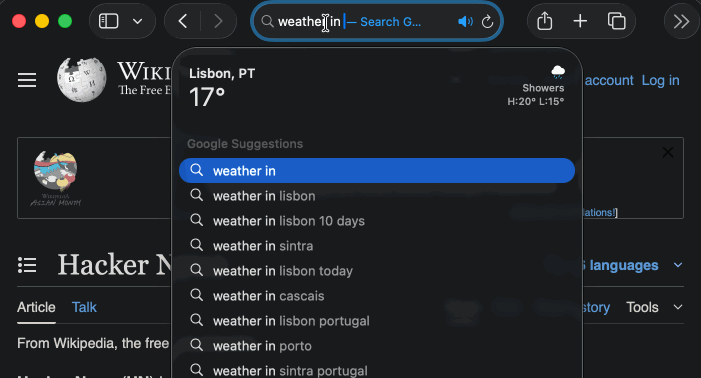
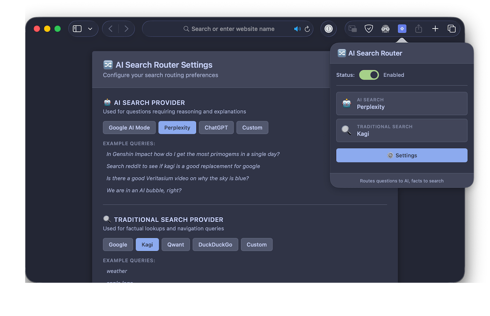

# AI Search Router



> ⚠️ **WARNING: AI-GENERATED DEMO CODE**
>
> This entire extension was AI-generated and is **unreviewed, unaudited slop code** created purely for demonstration purposes.
>
> **NO GUARANTEES:**
>
> - ❌ No guarantees about security
> - ❌ No guarantees about functionality
> - ❌ No support provided
> - ❌ Use entirely at your own risk
>
> **HOWEVER:**
>
> - ✅ 100% local code - no external APIs or libraries
> - ✅ No telemetry or analytics
> - ✅ No server backend
> - ✅ No AI calls during operation
> - ✅ Minimal browser performance impact (old-school pattern matching)
> - ✅ Developers cannot see anything you do - you're completely on your own
>
> This is provided as-is for educational/demo purposes only.

---

A browser extension that intelligently routes search queries to either AI-powered search engines or traditional search engines based on query classification.

## Overview

When you perform a search, the extension analyzes your query and automatically directs it to the most appropriate search engine:

- **AI Search** (e.g., Perplexity, ChatGPT, Google AI Mode) for questions requiring reasoning
- **Traditional Search** (e.g., Google, Kagi, DuckDuckGo) for factual lookups and navigation



## Features

- 🤖 **Intelligent Classification**: Automatically detects if your query is a question or a simple search
- 🔧 **Customizable Providers**: Choose your preferred AI and traditional search engines
- 🎯 **Custom URLs**: Add your own search provider URLs
- ⚡ **Fast & Lightweight**: Basic pattern matching for instant classification
- 🌐 **Cross-Platform**: Works on Safari and Chromium browsers

## Install on Safari (macOS)

This build is not notarized. macOS will warn that the app is from an unidentified developer.
Follow these steps once to approve it.

1. Download the latest DMG from the GitHub Releases page.
2. Install the app by dragging it to Applications folder.
3. Approve first launch (Gatekeeper) by right-clicking on the app and selecting "Open".
4. Open Safari Settings → Extensions and enable "AI Search Router". (Always Allow on Every Website)

## Install on Chromium browsers

1. Download the latest ZIP from the GitHub Releases page.
2. Unzip the file.
3. Open Chrome → Extensions → Load Unpacked and select the unzipped folder.
4. Enable "AI Search Router".

## Development

### Setup

```bash
# Install dependencies
pnpm install

# Build all packages
pnpm build

# Run tests
pnpm test
```

## How It Works

The extension uses simple pattern-based classification:

1. Checks if query contains W-words **anywhere** (who, what, where, when, why, how) - strong question indicators
2. Checks if query **starts with** question words (is, if, can, could, should, would, will, do, does, did)
3. Checks if query contains "?"
4. Checks if query contains "," or ";" (indicates complex/multi-part queries)
5. Checks for "but/and + question word" patterns (e.g., "but are they", "and does it")
6. Checks word count (>= 10 words indicates reasoning queries)

If any condition matches → route to AI search, otherwise → route to traditional search.

## License

Unlicense (Public Domain) - See LICENSE file for details.
